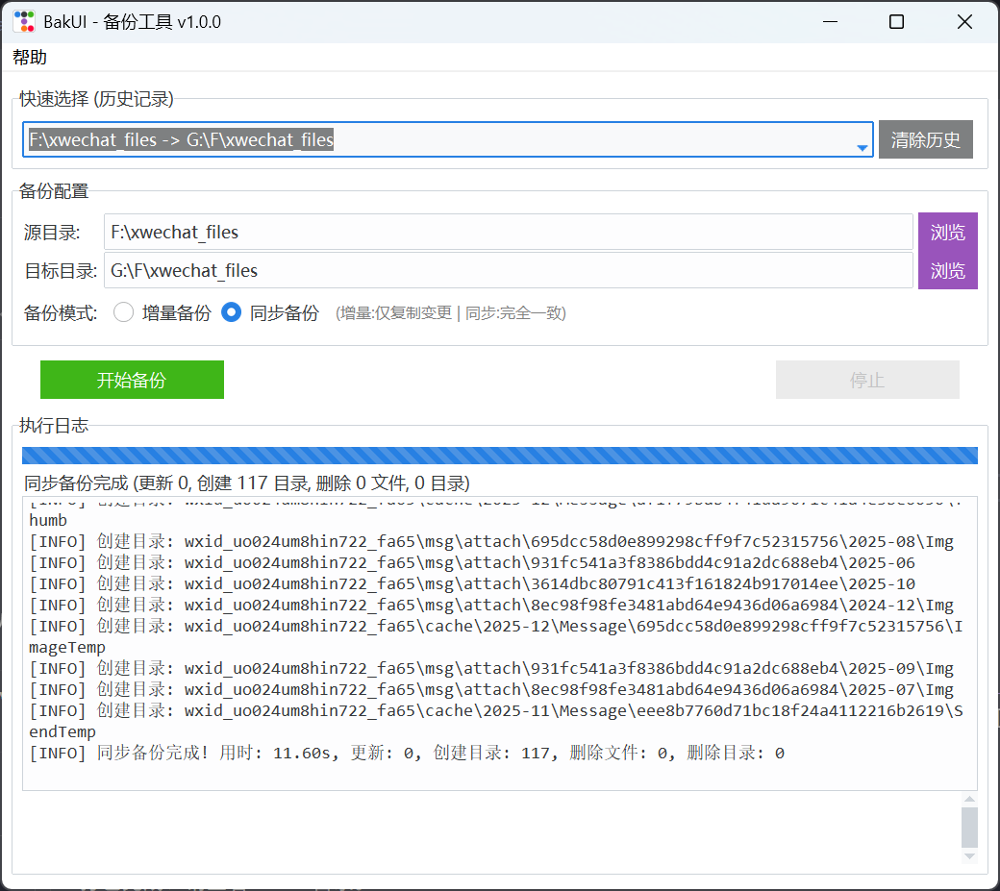

# Backup Tool

## 简介
一个轻量级的增量备份工具。
旨在解决记录丢失问题，支持将数据文件夹高效备份到 U 盘或其他存储介质。

## 功能特性
- **简单易用**: 纯 HTML 界面，无复杂配置。
- **增量备份**: 智能比对文件大小和修改时间，仅复制变更文件，极大提升速度。
- **实时进度**: 清晰展示备份进度、传输速度和文件详情。
- **断点续传**: 支持中途停止，下次再次运行时自动跳过已备份文件。

## 界面展示


## 快速开始

### 依赖环境
- Python 3.x
- 依赖库: Flask

### 安装与运行

1. **安装依赖**:
   ```bash
   pip install -r requirements.txt
   ```

2. **启动程序**:
   ```bash
   python run.py
   ```
   程序启动后会自动打开默认浏览器访问 `http://127.0.0.1:5000`。

### 更新日志
- 2025-11-28
    - 新增历史记录功能
